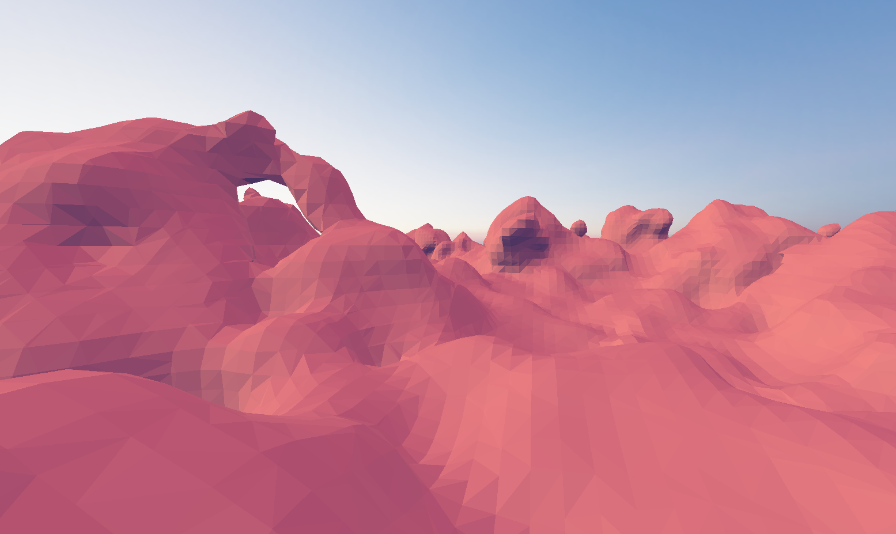
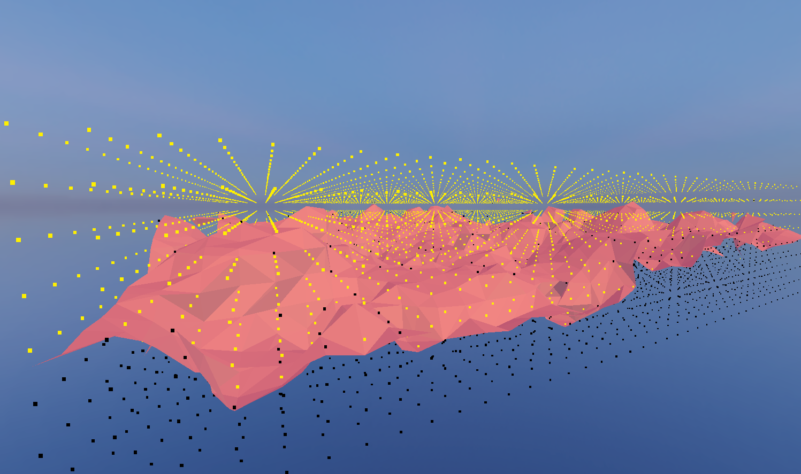
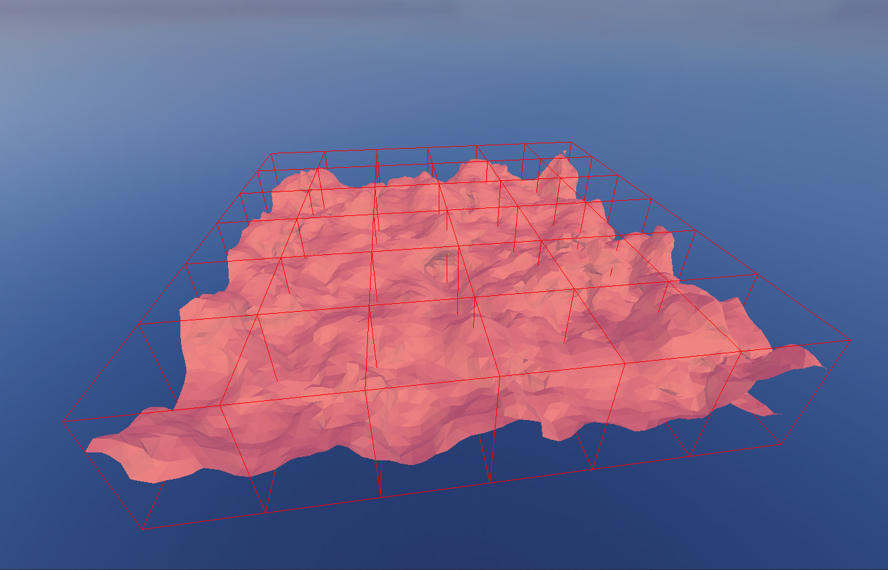

# Marching Cubes Algorithm with Three.js

## Overview
This is an implementation of the marching cubes algorithm using JavaScript and Three.js, aiming to create 3D surfaces from volumetric data. The marching cubes algorithm converts 3D scalar data into detailed surfaces, making it ideal for visualizing complex data like medical scans or terrain models.

## Features

### Dynamic Parameters
Change the parameters in the browser to find the desired result

### Dynamic Density Function
The density function currently uses a Fractional Brownian function with editable parameters 

### Indexed Mesh
The resulting mesh uses indexed verticies to improve memory usage

### Chunked Loading
The field is dynamically broked down into tiles. Allows for LOD implementation in the future

## Examples

### Cell Visualization

### Chunk Visualization

